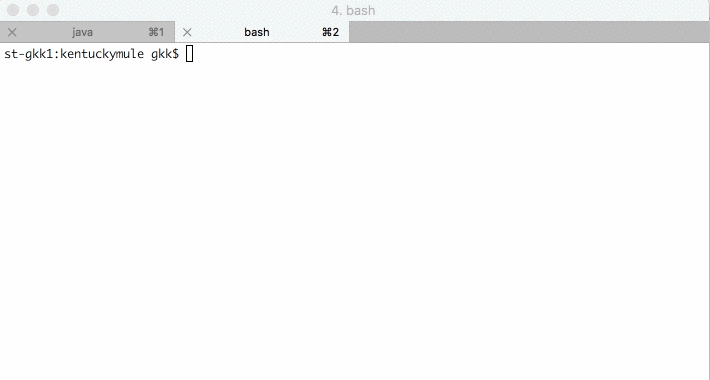

# Kentucky Mule

Kentucky Mule is an exploration of an alternative architecture for compiler design (specifically typechecker) with focus on speed.

Kentucky Mule's origins are described in my blog post [Can Scala have a highly parallel typechecker?] (https://medium.com/@gkossakowski/can-scala-have-a-highly-parallel-typechecker-95cd7c146d20)

Since the time I wrote the blog post, I rephrased the question into a twofold one with only a winning outcome:

> How to build a highly parallel and high performance typechecker, or does
> Scala have a fundamental language design flaw that prevents such from being built?

The prototype in this repo computes outline types I described in the blog post. The outline types enable computation of dependencies between symbols in the symbol table. Let's see this in action.

## Demo

Kentucky Mule is processes over two thousand lines of code in 700ms on a cold JVM.

Once JVM is warmed up the parser becomes bottleneck. If I skip parsing in benchmarking, Kentucky Mule calculates outline types at speed of processing over 4.4 million lines of Scala code.
